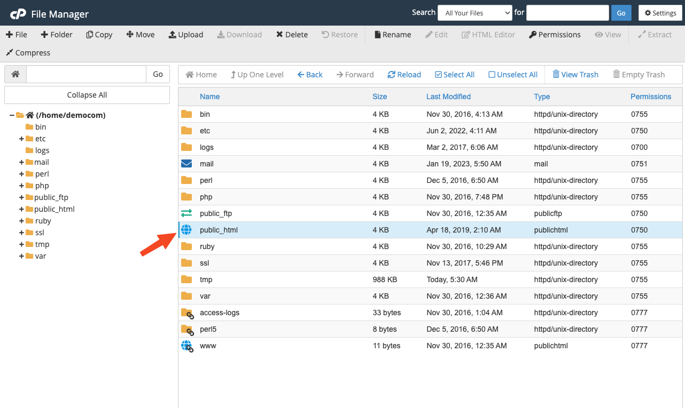
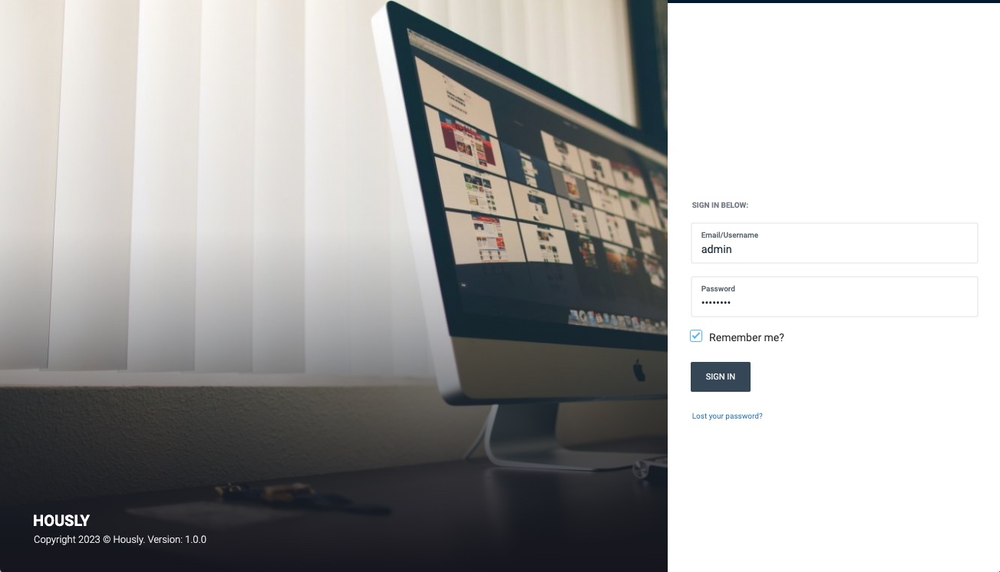

# Installation

## Requirement

- Apache, nginx, or another compatible web server.
- PHP >= 8.0 >> Higher
- MySQL Database server
- `BCMath` PHP Extension
- `Ctype` PHP Extension
- `Fileinfo` PHP extension
- `JSON` PHP Extension
- `Mbstring` PHP Extension
- `OpenSSL` PHP Extension
- `PDO` PHP Extension
- `GD` PHP Extension
- `Tokenizer` PHP Extension
- `XML` PHP Extension
- `exif` PHP Extension
- `rewrite` module server
- `PHP_CURL` module Enable

## PHP Configuration

Open your PHP configuration file `php.ini` and change the following settings:

```ini
memory_limit = 64M
max_execution_time = 300
```

If you are using cPanel, you can follow this article to change your PHP memory limit:
https://chemicloud.com/kb/article/how-to-increase-the-php-memory-limit-in-cpanel/

::: tip
On this project, we're using the latest Laravel version (currently 9.x).
Please go to [Laravel documentation](https://laravel.com/docs/9.x) page for more information.
:::

::: warning
It’s based on **Laravel framework**, the root folder for it is `/public`. You shouldn’t install it on a sub-folder, use sub-domain is better than sub-folder. (we won’t support to install our product on sub-folder).
:::

## Video tutorial install via GUI

<iframe width="100%" height="360" src="https://www.youtube.com/embed/QuOs-Qt_ZlQ" title="YouTube video player" frameborder="0" allow="accelerometer; autoplay; clipboard-write; encrypted-media; gyroscope; picture-in-picture" allowfullscreen></iframe>

## Install via GUI

- Create database and extract source codes into your web root directory.
- Go to `[your-domain.com]` to start installation.
- Step by step to setup your database conntection, site information and administrator.
- Login and setup your website on **Welcome Board**.

## Install on hosting (manual)

:::tip
If you're a Laravel developer, and you want to customize our source code in `platform/core` and `platform/packages`,
you need to delete folder `vendor` then run command `composer install` to reinstall PHP dependencies.
:::

### Install on hosting

- Upload all files into the root folder of your hosting (normally, it is `public_html`).



- Create a database and import data from `database.sql` (it's located in source code).
- Update your database credentials and `APP_URL` in `.env` file.

```
DB_HOST=127.0.0.1
DB_PORT=3306
DB_DATABASE="your_database_name"
DB_USERNAME="root"
DB_PASSWORD="your_password"
DB_STRICT=false
```

- Go to `/admin` to access to admin panel.
- The default admin account is `admin` - `12345678`.

### Install locally or in VPS

Update your database credentials and `APP_URL` in `.env`.

If you **want** to use sample data, import the data from `database.sql` file (the default admin account is `admin` - `12345678`).

If your **don't want** to use sample data, follow there step:

- Run `php artisan migrate` to create database structure.
- Run `php artisan cms:user:create` to create admin user.
- Run `php artisan cms:theme:activate hously` to activate the Hously theme.

Then you need to go to **Admin** -> **Plugins** then activate all plugins.

If you're pulled source code from GIT server:

- Run `php artisan vendor:publish --tag=cms-public --force`
- Run `php artisan cms:theme:assets:publish`

Run web locally:

- Change `APP_URL` in `.env` to `APP_URL=http://localhost`
- Run `php artisan serve`. Open `http://localhost`, you should see the homepage.
- Go to `/admin` to access to admin panel.



### Config to work on sub-folder

It’s based on Laravel framework, the root folder for it is `/public` so if you install it in a sub-folder,
you need to access `your-domain.com/sub-folder/public`. To remove `/public`, check below video.

<iframe width="100%" height="360" src="https://www.youtube.com/embed/XdAYETd04iA" title="Install Botble CMS in a subfolder" frameborder="0" allow="accelerometer; autoplay; clipboard-write; encrypted-media; gyroscope; picture-in-picture" allowfullscreen></iframe>

### Setup cron job

Cronjob is used to send emails abandoned carts notification automatically every week. You can ignore this step if you
don't need that feature.

```shell
* * * * * cd /path-to-your-project && php artisan schedule:run >> /dev/null 2>&1
```

You can learn more about setup cron job in cPanel at [here](https://help.fasthosts.co.uk/app/answers/detail/a_id/2198/~/setting-up-cron-jobs-in-cpanel).
