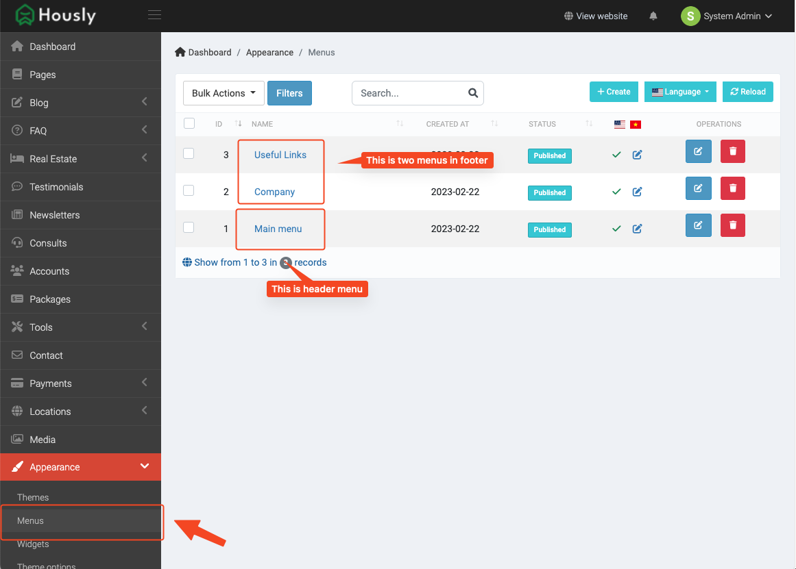
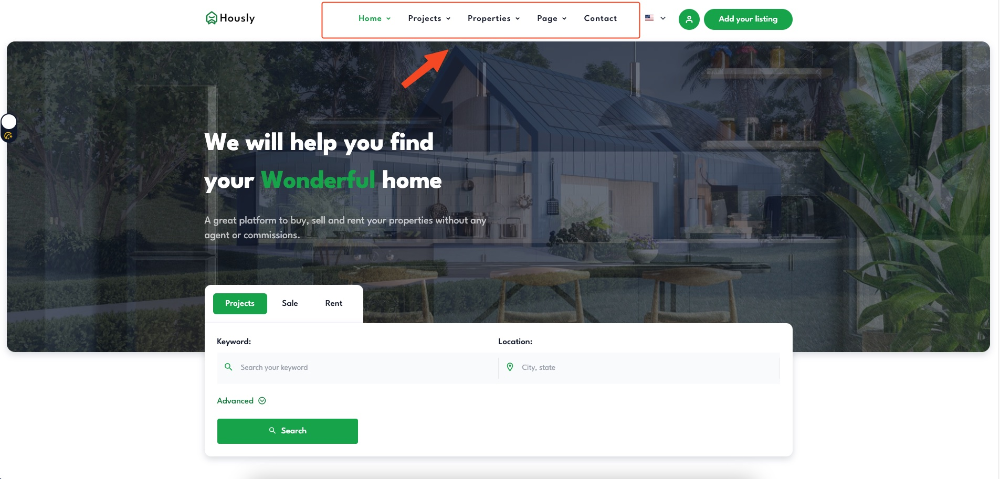
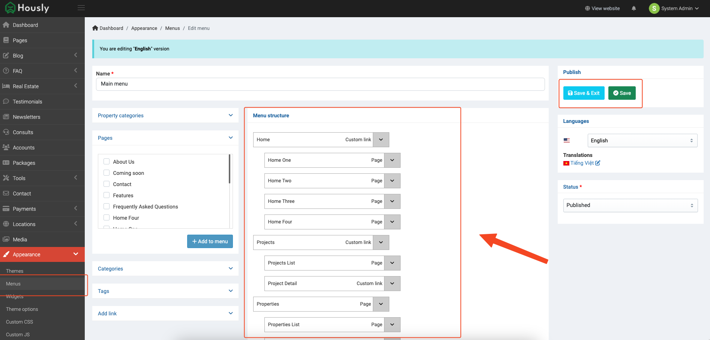
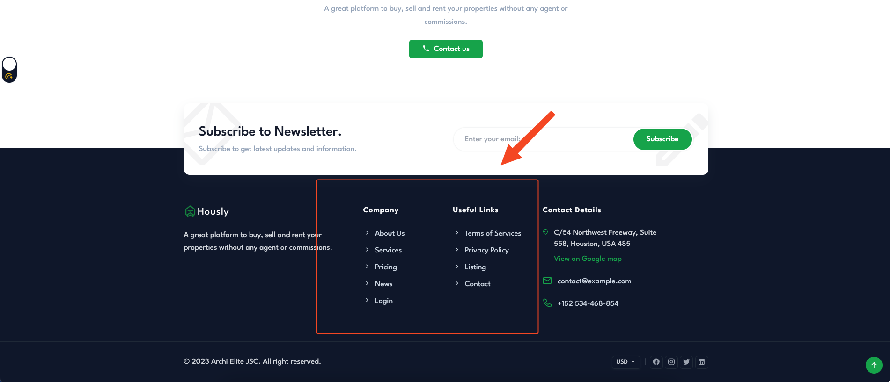
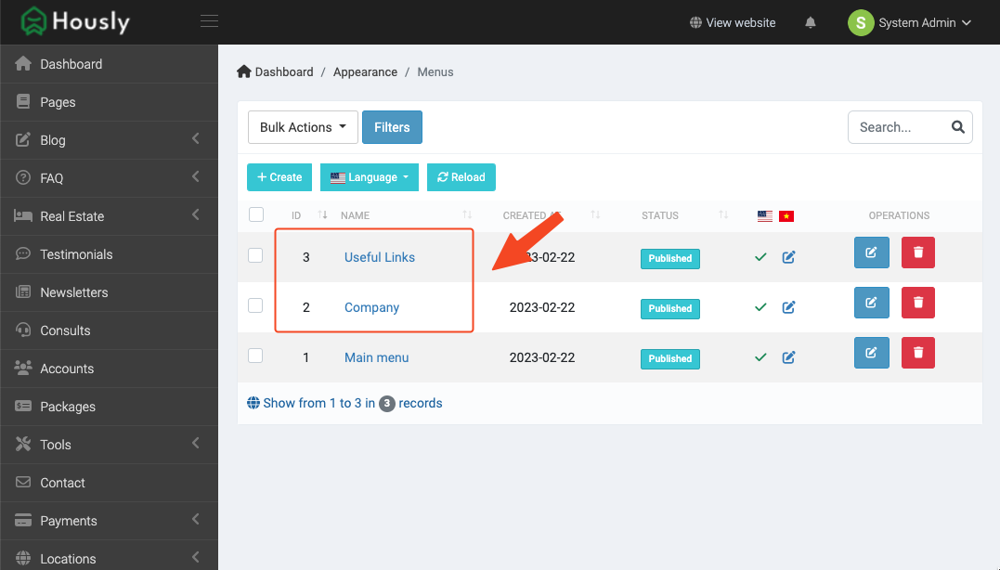

# Menus

::: tip INFO
In Hously theme, it have two menu is header menu and footer menu. You can add or edit them at **Admin** -> **Appearance** -> **Menus**.
:::

## Header Menu

You can update header menu in **Main menu**:

## Footer Menu

You can update footer menu in **Useful Links** and **Company**:

