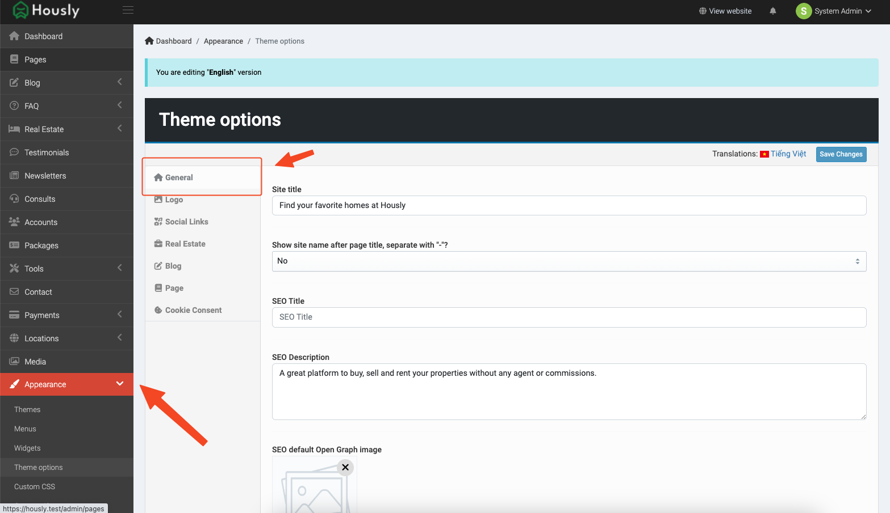
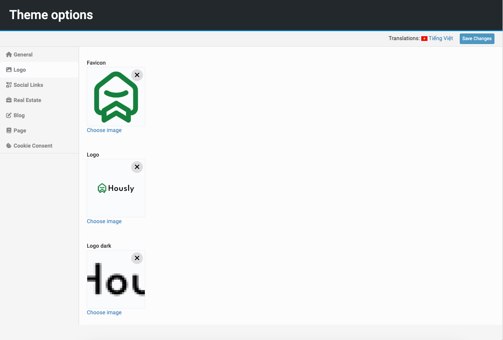
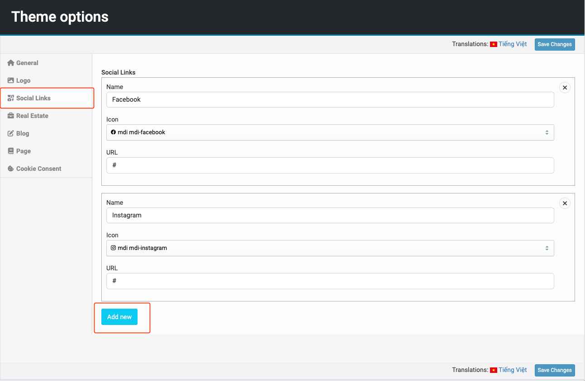
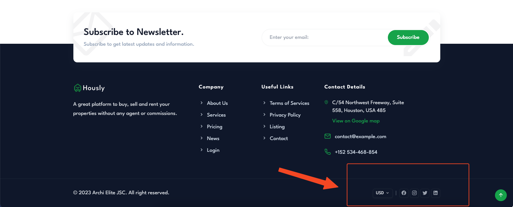

# Theme Options

**Theme options** is a place that users can customize their theme. These settings allow users to change the logo, colors, fonts, layout, and other aspects of the theme without needing to know how to code.

::: tip
Go to **Admin** -> **Appearance** -> **Theme options**.
:::

## General

In this **General** tab, there are have a lot of options to customize the site identity like `title`, `description`, `seo`, `colors`, `font`, `theme mode`, ...

## Logo & Favicon

In **Logo** tab, you can update the site `favicon`, `light logo` and `dark logo`.

## Social Links

**Social links** is the list of the socials that appear in the footer of the page. In this tab, you can add or remove the social links.

## Real Estate

In **Real Estate** tab, you can customize the `site backgrounds`, `layout`, `page`, `limit item` of **projects** or **properties**.

## Other

There are still some tabs like **Blog**, **Page** and **Cookie Consent**, you can discover more at **Admin** -> **Appearance** -> **Theme options**.
