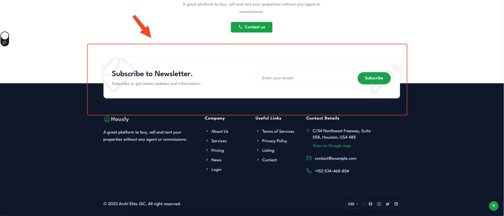

# Widgets

::: tip INFO
You can customize widgets in **Admin** -> **Appearance** -> **Widgets**. Below are we've suggested widgets for each widget section.
:::

## Pre Footer

Pre footer is the section above footer, you can use `Subscribe to Newsletter` here.

## Footer

In footer you can use there widgets: **Site Information**, **Custom Menu** and **Contact Information**.

:::tip
If you don't need to use the **Newsletter widgets**, you can deactivate it in `Admin` -> `Plugins` and click
to **Deactivate** button on **Newsletter** card.
:::

## Blog Sidebar

In blog sidebar, you can use **Blog Search**, **Blog Popular Categories**, **Blog Popular Tags** and **Blog Posts** widgets.

